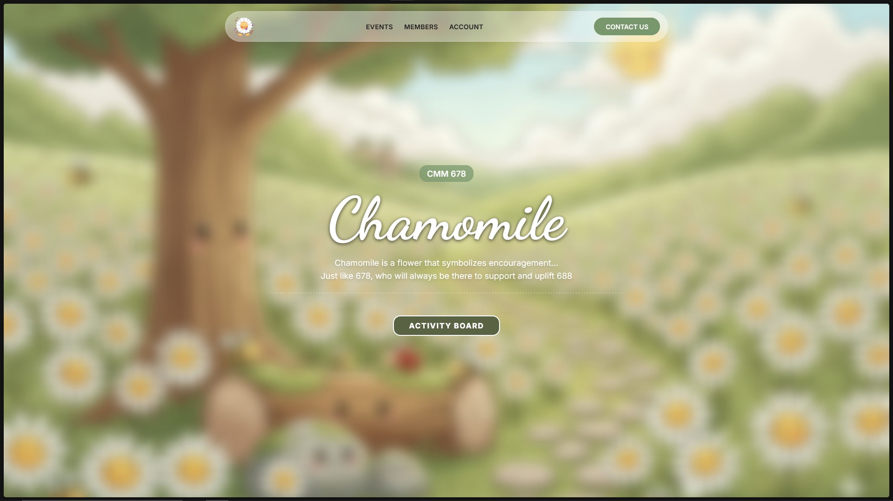
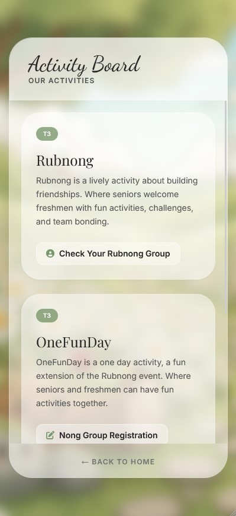

# MUIC Class Committee 678 Website

A mobile-first website with the main goal of event coordination.

Home page:

Event board:

## Highlights
 - Used cloudflare zero-trust solution to ensure secure HTTPS connection.
 - Announcing "Rubnong" groups number to freshmen using student ID based authentication.
 - Pairing seniors with freshmen as part of the "Secret Hug" event, aimed to help new students navigate their first year at MUIC.
 - Coordinating "Gift Exchange" events. Ensuring that the event runs smoothly using automated table partitioning algorithm and image upload system for gift identification, with email and student ID based authentication.
 - Event board for displaying upcoming events, along with relevant links such as sign-ups, informations, etc.
